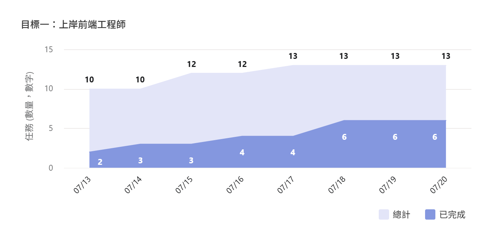
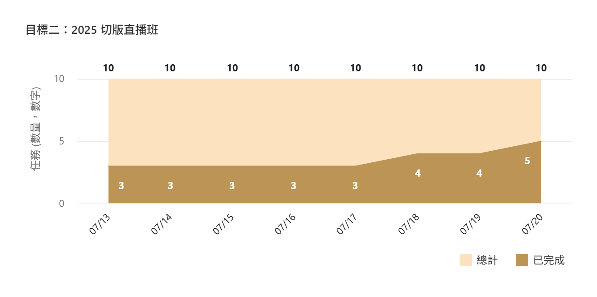
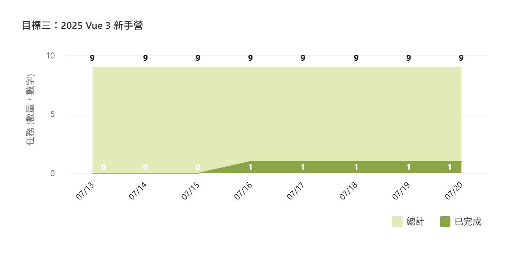
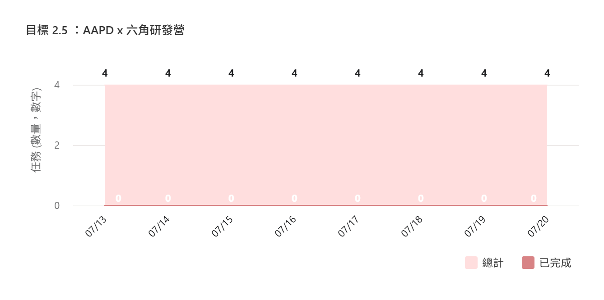

# 第 三 週
<br/>

## 📊 本週達成率統計
本週完成了多項任務，但仍有重要里程碑未完成，整體進度略低於預期。


- 項目總數：<span v-click> 15 </span> 項
- 完成總數：<span v-click> 6 </span> 項
- 達成率：<span v-click v-mark.circle.orange="3"> 40 </span> %


<style>
  span {
    color: #2B90B6;
  }
</style>
---
layout: 
---
## 目標狀態

<div class="grid grid-cols-2 gap-x-4">
<div v-click>



</div>
<div v-click>


</div>
<div v-click>


</div>
<div v-click>

- 尚未開始

</div>
</div>
---

# 上週亮點
本週成功完成了第三週主線任務和多項程式練習，同時也順利參與了面試和志工活動。

<v-clicks>

- 完成了第三週主線任務
- 寫了三題 30 Day of JavaScript
- 一間線上面試
- 完成部份商品內頁切版，及元件開發

</v-clicks>

<div v-click="7" class="grid grid-cols-2 gap-4">

```markdown [2634. Filter Elements from Array]
### 思考問題
- 要 `filter` 但不可以用 `.filter` 
- 跑 for 迴圈？來比對是不是 true
- 把符合的數值推回去

### pseudocode
- SET returnedArray to []
- i ++ loop arr
- IF fn(arr[i], i) is true THEN
- PUSH arr[i] into returnedArray
- returnedArray.push(if fn)

```
```markdown [2626. Array Reduce Transformation]
### 思考問題
- 不能使用 `.reduce` ，但要做出 `.reduce` 的效果
- reduce 就是陣列依 fn() 條件回傳出一個值(或物件)

### pseudocode
- SET accumulator to init
- IF nums.length <= 0 return accumulator
- LOOP i ++ <= nums.length
- accumulator to fn(accumulator, nums[i])
- return accumulator
```

</div>

<!-- 
[click] 有夠搞笑，我現在才想起來要做簡報，明明之前我們小組員還在聊說一定要做簡報不啦不啦
 -->

---
layout: image-left
image: https://images.unsplash.com/photo-1614122049516-955417b6b03d?q=80&w=1170&auto=format&fit=crop&ixlib=rb-4.1.0&ixid=M3wxMjA3fDB8MHxwaG90by1wYWdlfHx8fGVufDB8fHx8fA%3D%3D
---

# 上週低點
本週有幾項重要任務未能如期完成，可能影響整體學習進度。

- 第二週主線任務：品牌產品列表頁 <span v-mark.red="1"> 尚未完成 </span>
- 上週雖然只投遞了 <span v-mark.circle.green="2"> 6 </span> 間，但有 2 間面試機會以及 3 位獵頭
- 30 Day of JavaScript 未能按計劃完成

<!-- 
[click] 本週要來趕一下進度了，預計要到第四週完成

[click] 還算…可以？

- 因為主力放在準備上週的面試，以及週一(明天)的面試，所以就沒有寫，不過本週還是會補齊
 -->
---

# 精力與情緒
本週精力分配較為平均，但面對主線任務的延遲完成有些壓力。

- 本來就是屬焦慮鬼的，所以在準備完簡報之後，面試公司不按牌理出牌真的是…😶‍🌫️ <span v-click v-mark.red="1" class="text-6xl"> 很棒!! </span>
- 面試準備和參與消耗了較多精力，但也帶來了成就感
- 對於第二週主線任務：品牌產品列表頁未能如期完成感到些許焦慮
- 完成志工任務：直播分享會支援帶來了正面情緒


---
layout: center
---

# 下週計劃

- 下週一還有一場面試，但好像是駐點工程師，所以就是 <span v-mark.green="1"> 當練習面試用 </span> 了
- <span v-mark.red="2"> 主力完成 </span>：主線任務到第四週 <v-click at="3">(為了報名 AAPD)</v-click>
- 補齊 30 Day of JavaScript 及本週進度
- 如有餘裕：JS 奇怪的部份

---