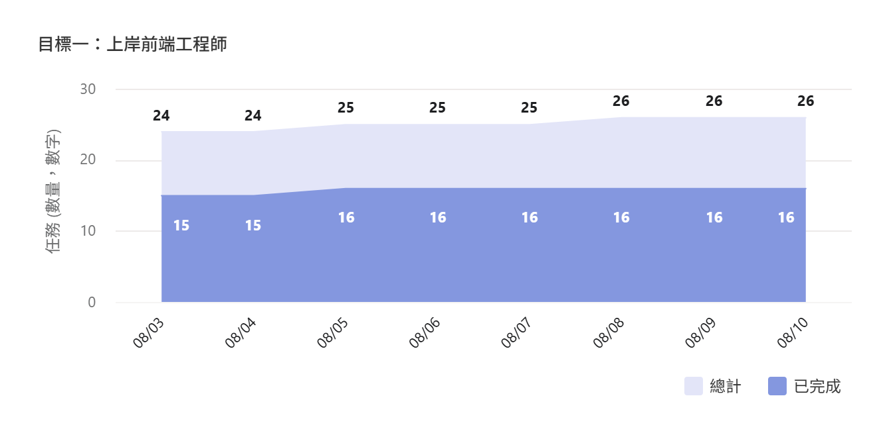
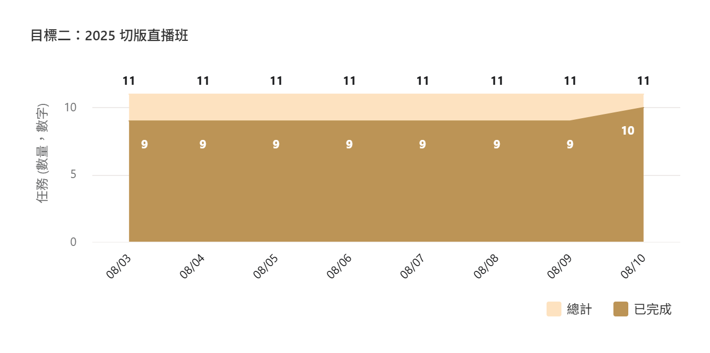
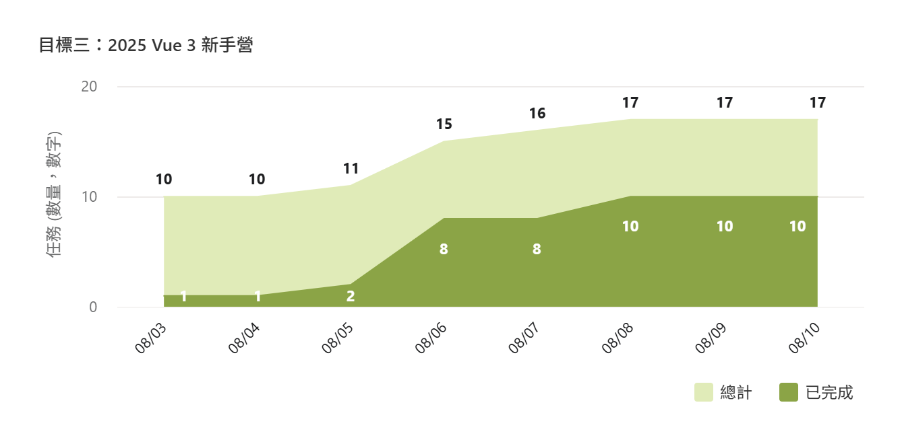
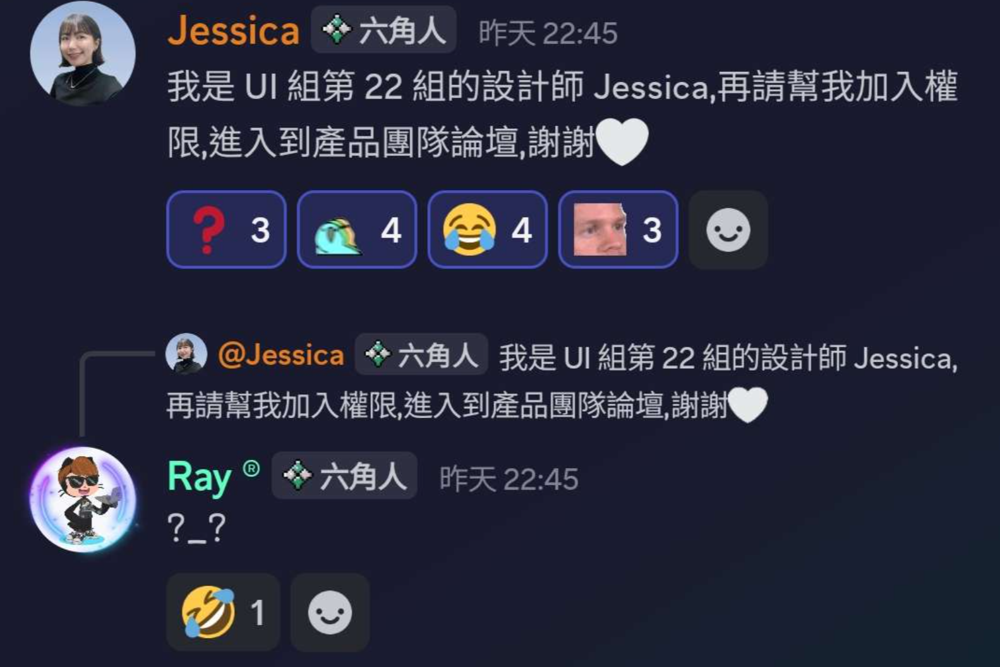
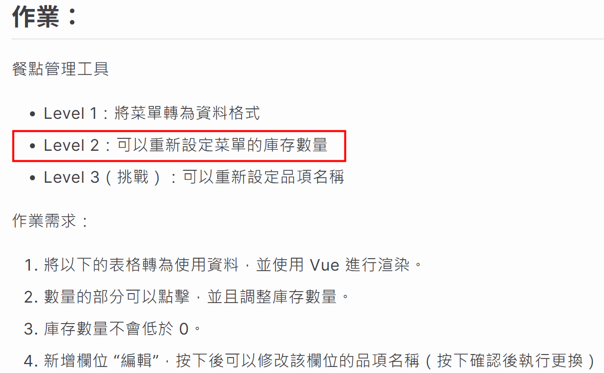
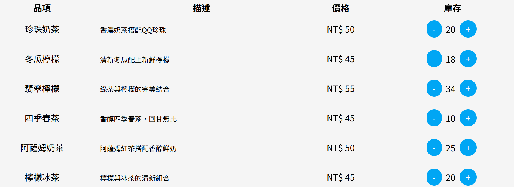

# 第 五 週
 

## 📊 本週達成率統計
本週完成了多項任務， 雖然身體狀況欠佳 ，但整體進度符合預期， 達成率持平 。

- 項目總數： 14  項
- 完成總數： 10  項
- 達成率： 71  %

<!-- 大家安安，好久不見XDD

[click] 上週的話身體欠佳跟大家請了假，而當週總項目為 14 項

[click] 實際完成總數為 10 項

[click] 達成率為 71% 保持持平
 -->
---
dragPos:
  square: 593,359,234,_
---

## 目標狀態

  

<!--
[click] 目前履歷持續投遞中，也繼續在收無聲卡；預計 8 月底後調整履歷並且增加投遞 Vue 的公司
接案的案子完成了第一次驗收與修改

[click] 切版直播已經結束啦，最後剩最終作業而已 (備註：下一週把這個移到最後一張)

[click] vue 的部份後面學習與新知段落再說明

[click] 研發營本週就是開營典禮啦~ 在奇怪的地方看到了很多奇怪的熟面孔ww
-->

---
layout: iframe-right

url: https://pinyiw0.github.io/vue-assignment1/

class: my-cool-content-on-the-left
---

# 學習與新知
<v-clicks>

- 學習了 Vue 的基本結構與語法
- 完成了 Vue 第一週作業
- 本週 Vue 每日任務、課前影音以及直播課

</v-clicks>

https://clovetseng.github.io/orderingSystem/

<!-- 
[click] 上週學習的 Vue 的基本結構與語法

[click] 上週開始學習了新框架 Vue 並且實作了第一週的作業，不過我暫時只有完成 lv2 等級ww，然後樂樂教練給我做巨美的是怎麼回事(???)

[click] 以及每日任務、及影音學習

-->
---
layout: image-left
image: https://images.unsplash.com/photo-1600272994589-048f925d57b3?q=80&w=987&auto=format&fit=crop&ixlib=rb-4.1.0&ixid=M3wxMjA3fDB8MHxwaG90by1wYWdlfHx8fGVufDB8fHx8fA%3D%3D
---

# 上週低點
本週有幾項重要任務未能如期完成，可能影響整體學習進度。

- JS 奇怪的部份還沒開始，有點拖到了
- 30 Day of JavaScript 放生好久了，要繼續執行了

<!-- 
[click] 
 -->
---
layout: center
---

# 下週計劃

- 補齊 30 Day of JavaScript 及本週進度
- JS 奇怪的部份
- Vue 第二週作業 - 登入註冊功能
- Vue 最終任務
- 設計交付工程協作線上講座