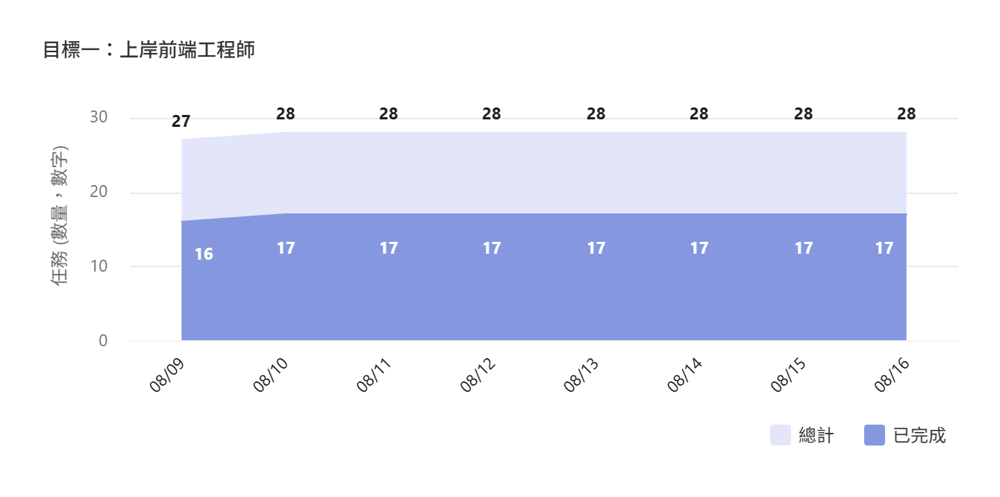
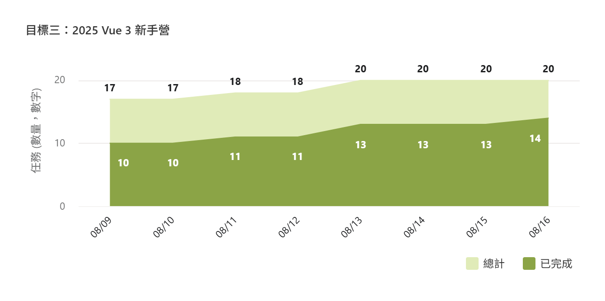
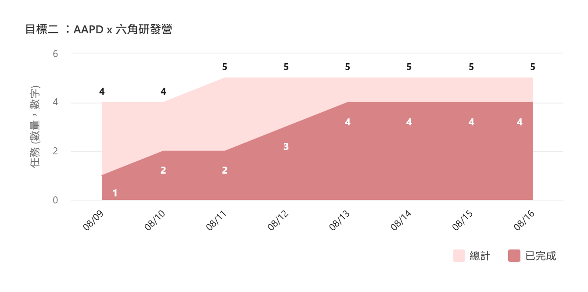
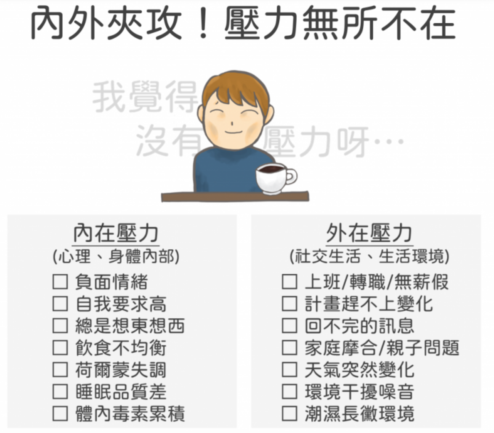
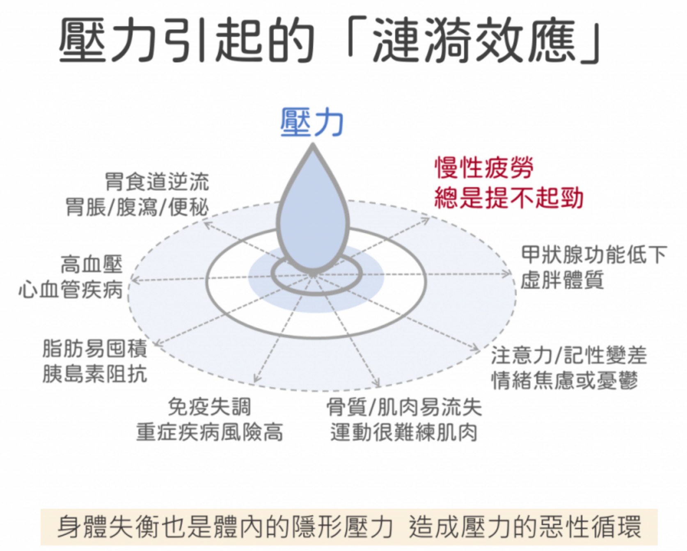
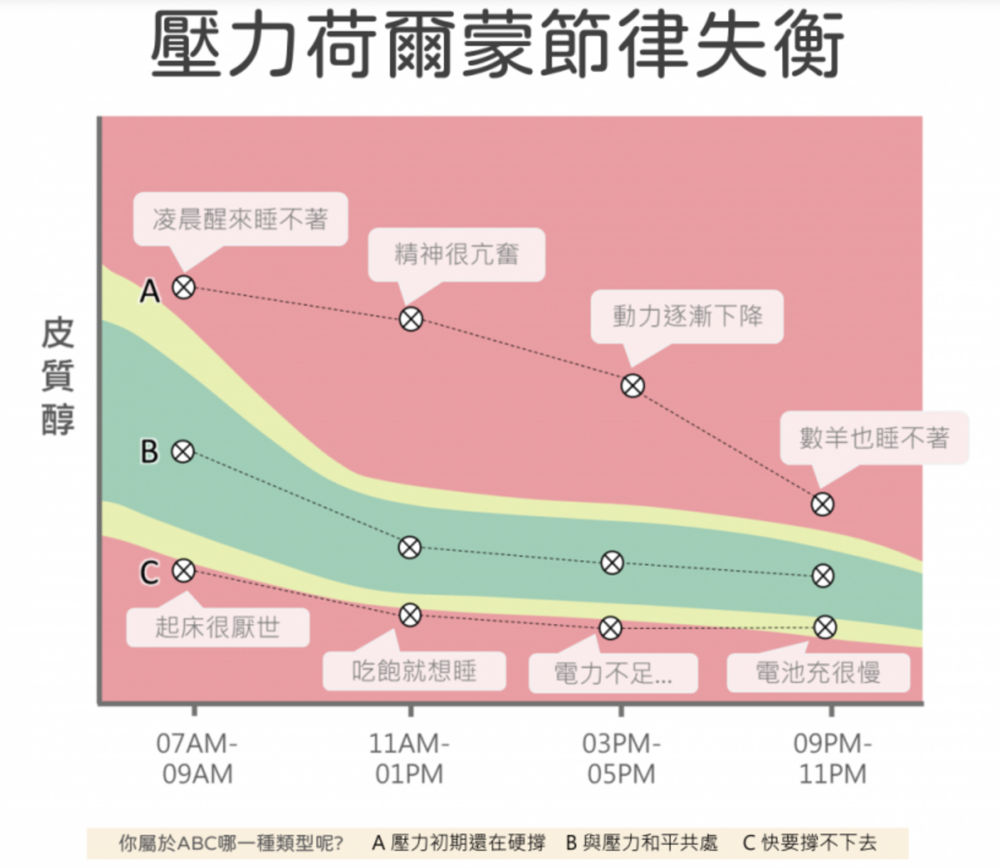
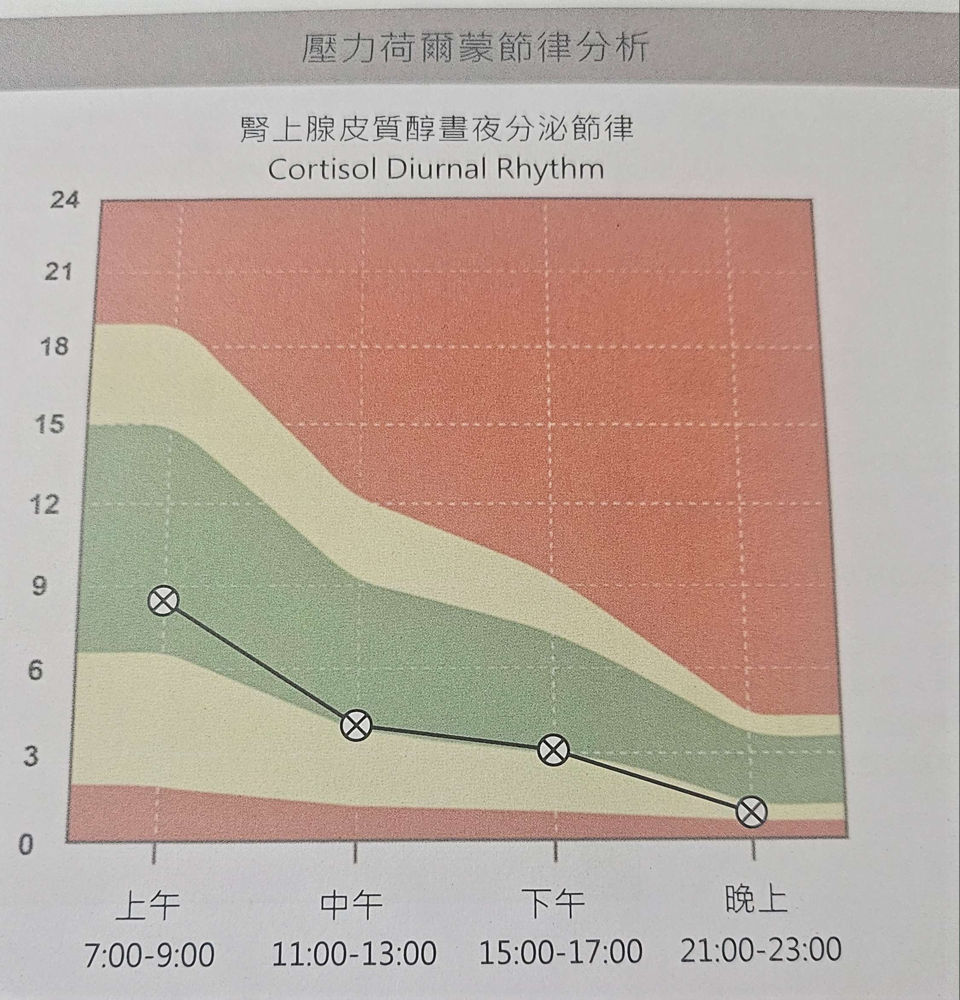

# 第 六 週

 

## 📊 本週達成率統計

本週完成了多項任務，整體進度符合預期，達成率維持良好水準

- 項目總數： 12  項
- 完成總數： 8  項
- 達成率： 76  %

<!-- 大家安安

[click] 上週總項目為 12 項

[click] 實際完成總數為 8 項

[click] 達成率為 67% 較上週略微下降，但整體進度符合預期，接著說明一下上週的細項
 -->

---

## 目標狀態

https://offwork.clovetseng.dev/

  

<!--
[click] 上週的話有有投了幾間，但比較多是把一些想投主要寫 Vue 的公司加入最愛ww

[click] vue 的部份目前已經學到了元件化的單元，然後因為生命週期跟 computed 我當時也沒仔細聽，所以又回頭去重看了今年跟去年的錄影回放，以及每日任務的部份

[click] 上週的話開了研發營的第一次會議，但主要重心放在了 vue 上面，所以 aapd 在分配完頁面跟技術討論後就先放生了 (反正原本預定的目標我啥也沒做就做完了???捲佑帶飛呀)
哦，另外一提，我們 aapd 是要使用 nuxt 和 tailwind 開發，所以我後面還要去淺補個 nuxt www

-->

---
layout: iframe-right

url: https://codepen.io/CloveTseng1026/embed/jEbGBOQ?default-tab=html%2Cresult

class: my-cool-content-on-the-left
---

# 學習與新知

<v-clicks>

- 學習了 Vue 生命週期、computed 及元件化的基礎知識
- 完成了 Vue 的 todolist 實作
- 每日任務

</v-clicks>

<!--
[click] 上週學習了生命週期、computed 及元件化的基礎知識
[click] 並且完成了 vue 的 todolist 實作
[click] 以及每日任務

-->

---
layout: image-left
image: https://images.unsplash.com/photo-1614122049516-955417b6b03d?q=80&w=1170&auto=format&fit=crop&ixlib=rb-4.1.0&ixid=M3wxMjA3fDB8MHxwaG90by1wYWdlfHx8fGVufDB8fHx8fA%3D%3D
---

# 上週低點

- JS 奇怪的部份有開始了，但進度還是有點慢
- 30 Day of JavaScript 雖然有一點點點點點的推進，但不多
- vue 第二週作業 - 登入註冊頁還沒執行

<!--
[click]
 -->

---
layout: center
---
# 下週計劃 (怎麼好像跟上週差不多？)

- 面試 ( 補一下 JS 面試 )
- 補齊 30 Day of JavaScript 及本週進度
- JS 奇怪的部份
- Vue 第二週作業 - 登入註冊功能
- Vue 最終任務

---
dragPos:
  square: 435,252,270,_
---

# 生活分享

<!--
最近因為什麼暈炫症啦、或是免疫失調的大過敏，然後大家都會常常聽到醫生說：不要給自己太大壓力、或是壓力減少了這個病症就會好了這種鬼故事，
所以做了壓力的檢測~想要知道自己是有多廢XD
[click] 這是網路上找到的一堆壓力的來源，我是覺得工程師蠻容易給自己內在壓力的，特別是一堆很捲的XD
[click] 順便也想要跟大家科普一下，壓力的堆積可能會造成一些顯性的身體問題發生
[click] 做完檢測後會收到一個長這樣的圖表，最理想一定是在綠綠的區間，表示就算有壓力，你的身體也可以很好的把他調回來
[click] 這是我做完的報告，雖然我感覺壓線，但醫生是說其實很不錯了，身體都有適應過來，如果有上班之後還想再測一次…感覺會爆XD?
-->
